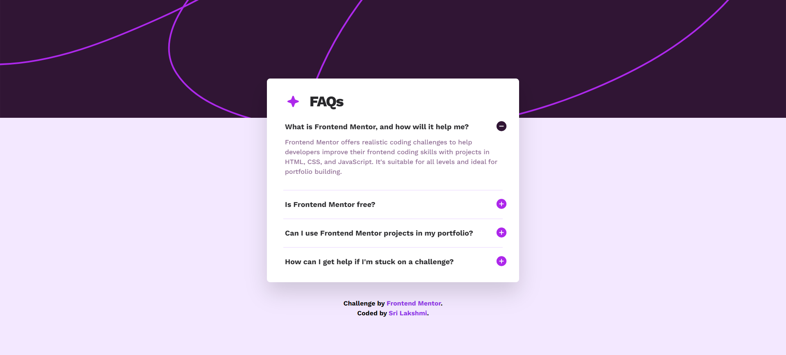

# Frontend Mentor - FAQ accordion solution

This is a solution to the [FAQ accordion challenge on Frontend Mentor](https://www.frontendmentor.io/challenges/faq-accordion-wyfFdeBwBz).

## Table of contents

- [Overview](#overview)
  - [The challenge](#the-challenge)
  - [Screenshot](#screenshot)
  - [Links](#links)
- [My process](#my-process)
  - [Built with](#built-with)
  - [What I learned](#what-i-learned)
  - [Continued development](#continued-development)
- [Author](#author)

## Overview

### The challenge

Users should be able to:

- Hide/Show the answer to a question when the question is clicked
- Navigate the questions and hide/show answers using keyboard navigation alone
- View the optimal layout for the interface depending on their device's screen size
- See hover and focus states for all interactive elements on the page

### Screenshot

### Links

- Solution URL: [Add solution URL here](https://your-solution-url.com)
- Live Site URL: [FAQ Accordion](https://faq-accordion-mbg.netlify.app/)

## My process

### Built with

- Semantic HTML5 markup
- Flexbox
- Mobile-first workflow
- JavaScript
- [Tailwind CSS](https://tailwindcss.com/) - For styles

### What I learned

- Learnt how to implement hover and focus states
- Learnt how to implement hide and show the answer to question
- I have also learnt how to hide other panels when one panel is active

### Continued development

- I would like to work on my javascript to implement features like hide/show and other features.

## Author

- Frontend Mentor - [@milkybeargeek](https://www.frontendmentor.io/profile/milkybeargeek)
- Twitter - [@milkybeargeek](https://twitter.com/milkybeargeek)
