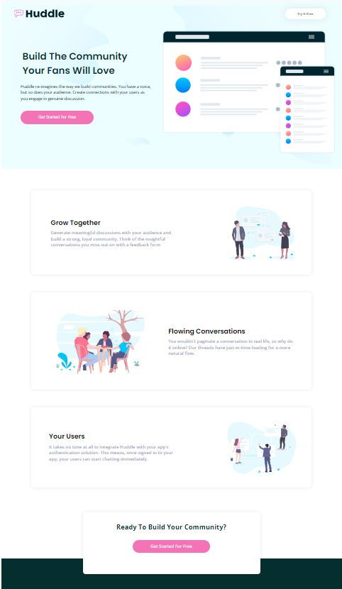
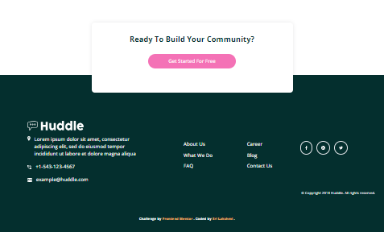

# Frontend Mentor - Huddle landing page with alternating feature blocks solution

This is a solution to the [Huddle landing page with alternating feature blocks challenge on Frontend Mentor](https://www.frontendmentor.io/challenges/huddle-landing-page-with-alternating-feature-blocks-5ca5f5981e82137ec91a5100)

## Table of contents

- [Overview](#overview)
  - [The challenge](#the-challenge)
  - [Screenshot](#screenshot)
  - [Links](#links)
- [My process](#my-process)
  - [Built with](#built-with)
  - [What I learned](#what-i-learned)
  - [Continued development](#continued-development)
  - [Useful resources](#useful-resources)
- [Author](#author)

## Overview

### The challenge

Users should be able to:

- View the optimal layout for the site depending on their device's screen size
- See hover states for all interactive elements on the page

### Screenshot

### Links

- Solution URL: (https://www.frontendmentor.io/challenges/huddle-landing-page-with-alternating-feature-blocks-5ca5f5981e82137ec91a5100/hub)
- Live Site URL: (https://huddle-landing-page-mbg.netlify.app/)

## My process

### Built with

- Semantic HTML5 markup
- CSS custom properties
- Flexbox
- Mobile-first workflow
- [Tailwind CSS] - For styles

### What I learned

- Deep dive about layout and responsiveness of the page
- Learnt more about hover states

### Continued development

- Will continue to work in responsive layouts and animations

### Useful resources

- [Box Shadows](https://manuarora.in/boxshadows) - This helped me for box shadow effect, it has curated list of box shadows for TailwindCSS.

## Author

- Frontend Mentor - [@milkybeargeek](https://www.frontendmentor.io/profile/milkybeargeek)
- Twitter - [@milkybeargeek](https://twitter.com/milkybeargeek)
