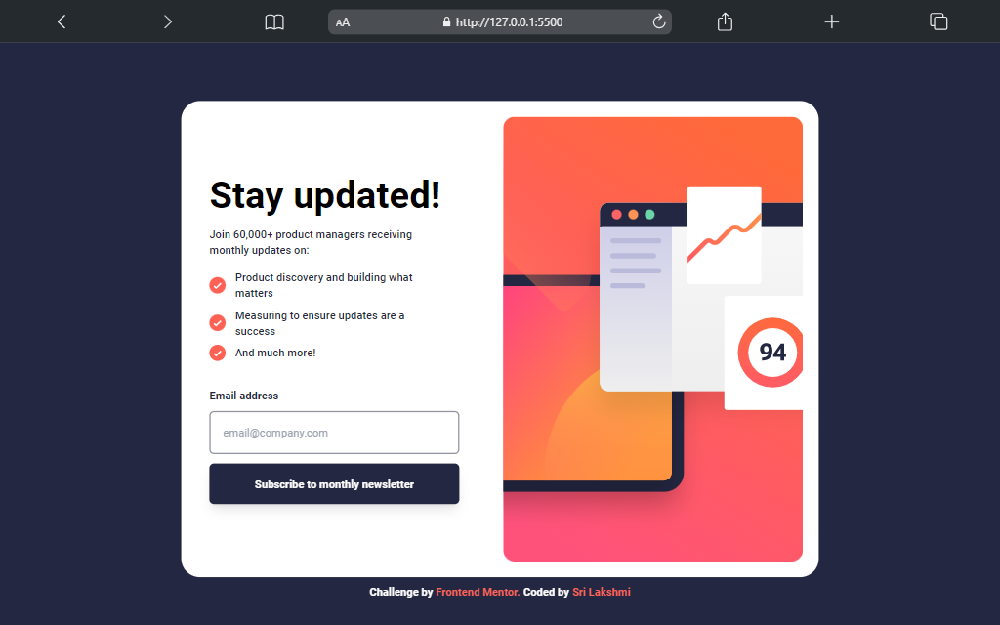

# Frontend Mentor - Newsletter sign-up form with success message solution

This is a solution to the [Newsletter sign-up form with success message challenge on Frontend Mentor](https://www.frontendmentor.io/challenges/newsletter-signup-form-with-success-message-3FC1AZbNrv).

## Table of contents

- [Overview](#overview)
  - [The challenge](#the-challenge)
  - [Screenshot](#screenshot)
  - [Links](#links)
- [My process](#my-process)
  - [Built with](#built-with)
  - [What I learned](#what-i-learned)
  - [Continued development](#continued-development)
- [Author](#author)

## Overview

### The challenge

Users should be able to:

- Add their email and submit the form
- See a success message with their email after successfully submitting the form
- See form validation messages if:
  - The field is left empty
  - The email address is not formatted correctly
- View the optimal layout for the interface depending on their device's screen size
- See hover and focus states for all interactive elements on the page

### Screenshot

### Links

- Solution URL:(https://www.frontendmentor.io/solutions/responsive-newsletter-signup-form-with-success-message-JYup7LMAgo)
- Live Site URL: (https://newsletter-signup-form-mbg.netlify.app/)

## My process

### Built with

- Semantic HTML5 markup
- Flexbox
- Mobile-first workflow
- JavaScript
- [Tailwind CSS](https://tailwindcss.com/) - For styles

### What I learned

## JavaScript Interaction:

1. Validating form inputs using JavaScript.
2. Displaying error messages for invalid inputs.
3. Showing/hiding elements based on user interaction (success message, error message, etc.).
4. Handling form submission and displaying success messages.

### Continued development

I would like to explore more on DOM manipulation, form validation like doing Real-time validation for instant feedback and also adding reset button. Also working with Client-Side Data Storage, AJAX requests

## Author

- Frontend Mentor - [@milkybeargeek](https://www.frontendmentor.io/profile/milkybeargeek)
- Twitter - [@milkybeargeek](https://twitter.com/milkybeargeek)
