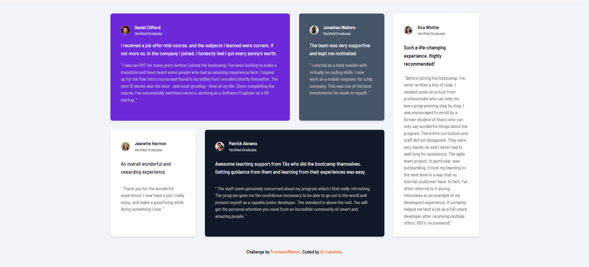

# Frontend Mentor - Testimonials grid section solution

This is a solution to the [Testimonials grid section challenge on Frontend Mentor](https://www.frontendmentor.io/challenges/testimonials-grid-section-Nnw6J7Un7).

## Table of contents

- [Overview](#overview)
  - [The challenge](#the-challenge)
  - [Screenshot](#screenshot)
  - [Links](#links)
- [My process](#my-process)
  - [Built with](#built-with)
  - [What I learned](#what-i-learned)
  - [Continued development](#continued-development)
  - [Useful resources](#useful-resources)
- [Author](#author)

## Overview

### The challenge

Users should be able to:

- View the optimal layout for the site depending on their device's screen size

### Screenshot

### Links

- Solution URL: [Add solution URL here](https://your-solution-url.com)
- Live Site URL: [Add live site URL here](https://your-live-site-url.com)

## My process

### Built with

- Semantic HTML5 markup
- CSS custom properties
- Flexbox
- CSS Grid
- Mobile-first workflow
- Tailwind CSS- For styles

### What I learned

- I learnt about CSS Grid and discovered how various factors like font size, padding, and margin can impact other grid templates. Understood these elements which are crucial for effectively designing and structuring layouts using CSS Grid.

### Continued development

- More projects that tackle with CSS Grid

### Useful resources

- [Layout Tailwind CSS](https://www.youtube.com/watch?v=eiRcOPiNoDs&ab_channel=ChaiaurCode)

## Author

- Frontend Mentor - [@milkybeargeek](https://www.frontendmentor.io/profile/milkybeargeek)
- Twitter - [@milkybeargeek](https://twitter.com/milkybeargeek)
