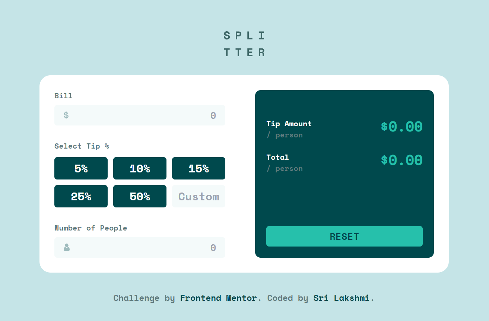

# Frontend Mentor - Tip calculator app solution

This is a solution to the [Tip calculator app challenge on Frontend Mentor](https://www.frontendmentor.io/challenges/tip-calculator-app-ugJNGbJUX).

## Table of contents

- [Overview](#overview)
  - [The challenge](#the-challenge)
  - [Screenshot](#screenshot)
  - [Links](#links)
- [My process](#my-process)
  - [Built with](#built-with)
  - [What I learned](#what-i-learned)
  - [Continued development](#continued-development)
- [Author](#author)

## Overview

### The challenge

Users should be able to:

- View the optimal layout for the app depending on their device's screen size
- See hover states for all interactive elements on the page
- Calculate the correct tip and total cost of the bill per person

### Screenshot

### Links

- Solution URL: [Add solution URL here](https://www.frontendmentor.io/challenges/tip-calculator-app-ugJNGbJUX/hub)
- Live Site URL: (https://tip-calculator-mbg.netlify.app/)

## My process

### Built with

- Semantic HTML5 markup
- CSS custom properties
- Flexbox
- CSS Grid
- Mobile-first workflow
- JavaScript
- Tailwind CSS

### What I learned

### 1. DOM Manipulation

The code interacts with the Document Object Model (DOM) using methods such as `getElementById`, `querySelectorAll`, and `addEventListener` to dynamically access and modify HTML elements based on user interactions.

### 2. Event Handling

Event listeners are set up to respond to user actions such as input changes (`input` event), button clicks (`click` event), and page loading (`DOMContentLoaded` event), enabling dynamic updates to the interface.

### 3. Input Validation

User input is validated to ensure it meets specific criteria. For example, the code checks if the bill amount and number of people are valid numbers and not zero. Error messages are displayed if invalid input is detected.

### 4. Conditional Statements

Conditional statements (`if`, `else if`, `else`) are used to execute different blocks of code based on certain conditions. For instance, the code checks if the bill amount is zero or if the number of people is zero and takes appropriate actions accordingly.

### 5. Looping

Loops are utilized to iterate over collections of elements and perform operations on each element. For example, a loop is used to add event listeners to multiple tip percentage buttons, enhancing code efficiency and maintainability.

### 6. Functions

Several functions are defined to encapsulate and organize blocks of code with specific functionalities, promoting code reusability and maintainability.

### 7. Variable Scope

Variables are declared using `let` and `const` keywords to ensure proper scope within functions and blocks of code, preventing accidental variable hoisting or unintended side effects.

### 8. String Manipulation

String manipulation operations such as concatenation (`textContent`) and formatting (`toFixed`) are performed to display calculated values in the user interface, enhancing the readability and usability of the application.

By incorporating these key concepts, the code effectively implements the desired functionality of a tip calculator web application, providing a user-friendly experience for calculating tips based on various inputs.

### Continued development

- DOM Manipulation
- Asynchronous JS

## Author

- Frontend Mentor - [@milkybeargeek](https://www.frontendmentor.io/profile/milkybeargeek)
- Twitter - [@milkybeargeek](https://twitter.com/milkybeargeek)
